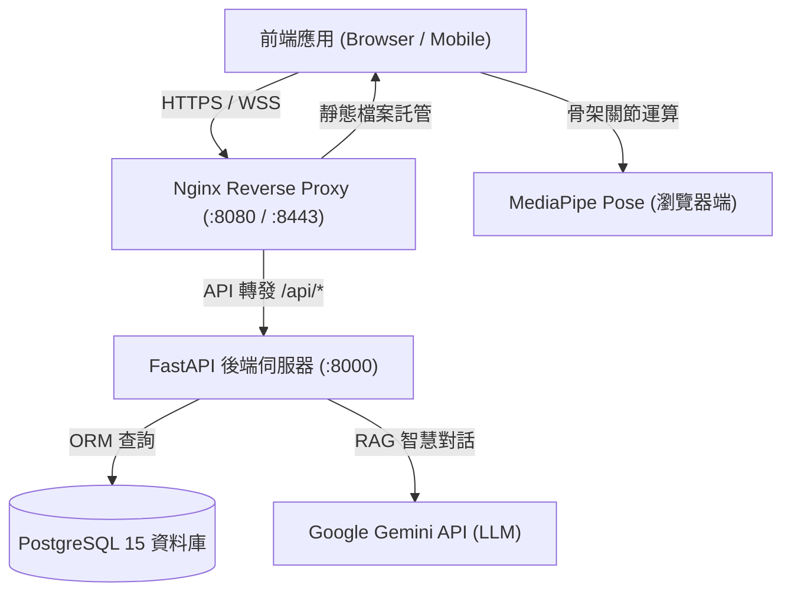

# 🎖️ 模擬大兵 SimSoldier
> **全方位役男入伍生存與智慧輔助戰情系統**  
> *A Comprehensive Smart Guidance and Military Survival Simulation System for Conscripts.*

[](https://fastapi.tiangolo.com/)
[](https://www.python.org/)
[](https://www.postgresql.org/)
[](https://ai.google.dev/)
[](https://developers.google.com/mediapipe)
[](https://www.docker.com/)

---

## 📖 專案簡介

「**模擬大兵 SimSoldier**」是專為台灣役男量身打造的現代化軍旅輔助與生活適應平台。透過智慧化情境導引、AI 姿態視覺辨識、智慧問答教官與互動式軍旅模擬，打破新兵對於軍旅未知的焦慮與資訊斷層，從收到徵集令到光榮退伍，提供全程一站式數位輔助。

---

## 🌟 核心功能特色

### 1. 🧭 情境分流導引系統 (Scenario Triage System)
針對役男不同兵役階段，提供客製化情境身分切換與專屬指引：
- **行前準備**：優先推薦「入伍背包」、「新訓地點」與「行政中心」。
- **役男入營**：優先推薦「戰情儀表板」、「體能測驗」與「教官聊天室」。
- **延緩入營**：優先推薦「延役專區」、「體位標準」與「行政諮詢」。

### 2. 📊 戰情儀表板 (Dashboard)
- **巨型倒數計時器**：精準計算距離入營或離營剩餘天數。
- **個人兵籍體位分析**：自動試算 BMI 並比對內政部最新常備役／替代役／免役體位標準。
- **三階段軍旅旅程**：視覺化階段任務勾選（行前整備、軍事訓練期、部隊生活期）。

### 3. 🏃 AI 體能測驗 (AI Fitness Training)
- 透過 **Google MediaPipe Pose** 進行即時人體骨架偵測與關節角度分析。
- 支援 **徒手深蹲 (Squats)**、**伏地挺身 (Pushups)** 與 **仰臥起坐** 動作計數與標準姿勢檢驗。

### 4. 🤖 智慧教官聊天室 (AI Drill Instructor Chat)
- 基於 **Google Gemini API** 搭配軍事規程 Prompt Engineering 與 **ChromaDB** 向量知識庫。
- 支援口氣嚴厲的威嚴部隊模式與貼心諮詢模式，隨時解答役政法規、軍旅日常生活與心理輔導。

### 5. 🗺️ 全台新訓營區地圖 (Interactive Camp Map)
- 整合 **Leaflet.js** 互動圖資，收錄成功嶺、金六結、斗煥坪、官田、龍泉等全台 14 個主要新訓中心。
- 支援軍種篩選（陸軍、海軍、海軍陸戰隊），卡片標註交通指南、營區特色與生活機能。
- 頂端營區下拉選單快速切換，雙向連動地圖並預留最大化可視操作範圍，一鍵直通 Google Maps 規劃路線。

### 6. 🎮 模擬軍旅 (Military Life RPG)
- 互動式文字冒險劇情分支小遊戲（Visual Novel Style）。
- 體驗新訓第一天報到、剃頭、填寫身家調查、內務整頓到結束新訓經典情境。

### 7. 🎒 入伍背包與後勤準備 (Inventory Checklist)
- 依重要性將入伍裝備分級分類（證件必備、生活日常、個人醫療、防護收納）。
- 支援即時勾選儲存、進度百分比計算與一鍵重置清單。

### 8. 📝 天兵課堂 (Military Knowledge Quiz)
- 隨機抽題測驗庫，題目涵蓋軍紀法規、軍銜識別、違禁品規範與部隊禮儀。
- 即時評分、解析與答題數據紀錄。

### 9. 🎯 射擊口訣模擬 (Shooting Drill Guide)
- 單兵步槍「托、抵、握、貼、瞄、停、扣、報」八大射擊要領教學。
- 三點一線瞄準技巧視覺輔助。

### 10. ⏳ 延役專區與行政中心 (Delay & Administrative Docs)
- 在學緩徵、出國因事因病延期徵集資格與申辦流程指引。

---

## 🛠️ 系統架構與技術棧



| 領域 | 技術項目 | 說明 |
| :--- | :--- | :--- |
| **前端開發** | HTML5, Vanilla ES6+ Modules | 高效純原生 JavaScript 模組化開發 |
| **樣式設計** | Tailwind CSS, Custom CSS | 軍事戰情風格、Glassmorphism、深色/淺色主題切換、RWD 響應式 |
| **視覺與地圖** | Leaflet.js, FontAwesome 6 | 開源互動地圖與軍旅主題向量圖示庫 |
| **端側 AI** | Google MediaPipe Pose | 瀏覽器前端即時人體骨架辨識與動作分析 |
| **後端核心** | Python 3.11, FastAPI, Uvicorn | 高效能非同步 RESTful API 架構 |
| **身份安全** | OAuth2, JWT, Passlib (Bcrypt) | 權限驗證與密碼加密安全防護 |
| **資料持久化** | PostgreSQL 15, SQLAlchemy ORM | 關聯式資料庫與資料對映操作 |
| **智慧生成** | Google Gemini API, ChromaDB | 自然語言大型語言模型與向量檢索 |
| **容器部署** | Docker, Docker Compose, Nginx | 多服務容器編排與反向代理整合 |

---

## 📂 專案目錄結構

```text
simSoldier/
├── backend/                  # 後端核心服務
│   ├── app/
│   │   ├── main.py           # FastAPI 入口與 API 路由定義
│   │   ├── auth.py           # JWT 驗證與密碼雜湊
│   │   ├── database.py       # SQLAlchemy 資料庫連線配置
│   │   ├── models.py         # ORM 資料模型 (User, Profile, Quiz 等)
│   │   ├── schemas.py        # Pydantic 請求與回應格式定義
│   │   ├── chat.py           # Gemini AI 聊天室核心
│   │   └── chat_config.py    # 教官系統提示詞與知識庫定義
│   ├── data/                 # 預設題庫 CSV 與統計數據
│   ├── initdb.sql            # PostgreSQL 初始化腳本
│   ├── requirements.txt      # Python 依賴套件
│   ├── Dockerfile            # 後端容器映像構建設定
│   └── .env                  # 後端環境變數
├── frontend/                 # 前端網頁應用
│   ├── index.html            # 主戰情中心首頁
│   ├── login.html            # 登入與註冊頁面
│   ├── loadingbar.html       # 轉場與傘兵下降動畫加載頁
│   ├── style.css             # 全域客製風格與動畫樣式
│   ├── js/                   # 前端模組
│   │   ├── main.js           # 應用入口與狀態控制
│   │   ├── api.js            # 後端 API 呼叫封裝
│   │   ├── ui.js             # UI 元素快取與視圖切換
│   │   ├── features.js       # 核心業務功能與事件處理
│   │   ├── state.js          # 全域響應狀態與任務定義
│   │   ├── map.js            # Leaflet 地圖初始化與營區聯動
│   │   ├── training_ai.js    # MediaPipe AI 骨架偵測訓練演算法
│   │   ├── quiz.js           # 天兵課堂答題邏輯
│   │   ├── delay.js          # 延役專區計算邏輯
│   │   └── shooting.js       # 射擊要領模擬
│   └── game/                 # 模擬軍旅 (RPG 遊戲模組)
│       ├── game.html         # 遊戲頁面
│       └── story.json        # 劇情樹與對話節點設定
├── docker-compose.yml        # Docker 一鍵編排設定 (DB + Backend + Frontend)
└── README.md                 # 專案說明文件
```

---

## 🚀 快速啟動指南

### 使用 Docker Compose（推薦，一鍵運行）

1. **確認已安裝環境**：
   - [Docker Desktop](https://www.docker.com/products/docker-desktop/) (已啟用 Docker Compose)
   - [Git](https://git-scm.com/)

2. **複製專案庫**：
   ```bash
   git clone -b master --single-branch https://github.com/XXXG-00W0-wing/simSoldier.git
   cd simSoldier
   ```

3. **配置後端環境變數**：
   檢查並確認 `backend/.env` 包含有效的 Google Gemini API Key：
   ```env
   DATABASE_URL=postgresql://postgres:postgres@db/simsoldier
   SECRET_KEY=your_super_secret_key_change_me
   ALGORITHM=HS256
   ACCESS_TOKEN_EXPIRE_MINUTES=30
   GEMINI_API_KEY=your_gemini_api_key_here
   ```

4. **啟動容器服務**：
   ```bash
   docker compose up -d --build
   ```

5. **存取服務**：
   - 🌐 **前端網站**：[http://localhost:8080](http://localhost:8080)（或 HTTPS [https://localhost:8443](https://localhost:8443)）
   - ⚙️ **後端 API 文件**：[http://localhost:8000/docs](http://localhost:8000/docs)
   - 預設測試帳號：`testuser` / 密碼：`password123`

---


---

## 📡 核心 API 端點概要

| 方法 | 路徑 | 說明 | 認證需求 |
| :--- | :--- | :--- | :---: |
| `POST` | `/api/register` | 新使用者註冊 | 否 |
| `POST` | `/api/login` | 帳號登入並取得 JWT Access Token | 否 |
| `GET` | `/api/user_info` | 取得當前登入者兵籍資料與情境設定 | 是 |
| `POST` | `/api/user_edit` | 更新兵籍資料、體位或修改密碼 | 是 |
| `POST` | `/api/chat` | 傳送訊息給 AI 教官進行諮詢 | 是 |
| `GET` | `/api/quiz/random` | 隨機獲取軍事常識測驗題目 | 否 |
| `POST` | `/api/training/start` | 取得防作弊訓練 Session Token | 否 |
| `POST` | `/api/training/complete`| 驗證並提交 AI 體能測驗成績 | 否 |
| `GET` | `/api/cohort-stats` | 取得役齡男子兵籍調查概況統計 | 否 |

---


---
<p align="center">Made with ❤️ for all Taiwanese Conscripts</p>
