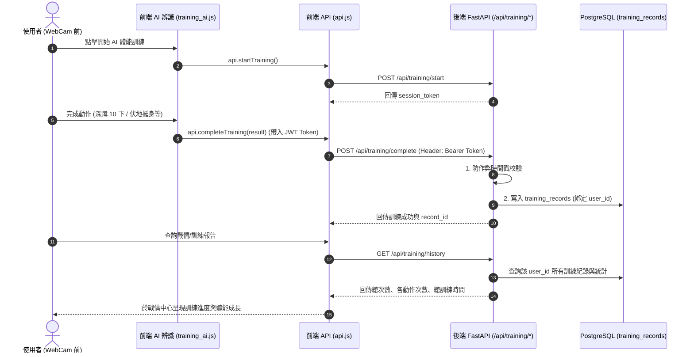

# AI 體能訓練紀錄 (training_records) 與使用者帳號綁定及數據整合計畫

## 一、 背景與現況說明
目前的 `training_records` 資料表為 AI 鏡頭動作檢測（深蹲、伏地挺身、敬禮等）所設計，但先前未與登入使用者的 `user_id` 綁定，前端 `api.js` 也尚未實作完整的通訊介面。
本計畫將把 AI 動作辨識的訓練成果與使用者帳號進行深度關聯，並提供統計與歷史紀錄 API。

---

## 二、 架構與資料流 (Data Flow)

---

## 三、 系統相容設計
1. **已登入使用者**：自動將訓練紀錄歸戶至該使用者的 `user_id`，並納入其個人戰情報告統計。
2. **訪客（未登入者）**：依然允許進行 AI 訓練體驗（`user_id=None`），不強制中斷。

---

## 四、 預定修改項目

### 1. 後端架構與端點 (Backend FastAPI & Auth)
- **`backend/app/auth.py`**：
  - 新增 `get_current_user_optional`：若請求帶有有效 Token 則回傳 `current_user`，若無 Token 則回傳 `None`。
- **`backend/app/schemas.py`**：
  - 新增 `TrainingRecordResponse` 與 `TrainingStatsResponse`（包含總訓練次數、總時長、各動作統計如 squats / push_ups / salute 次數、最近紀錄）。
- **`backend/app/main.py`**：
  - 更新 `/api/training/complete`：將 `user_id = current_user.id if current_user else None` 寫入 `models.TrainingRecord`。
  - 新增 `/api/training/history` 端點：回傳登入使用者的歷史訓練紀錄與數據統計。

### 2. 前端 API 與模組對接 (Frontend JS)
- **`frontend/js/api.js`**：
  - `startTraining()`: 呼叫 `POST /api/training/start` 取得 Session Token。
  - `completeTraining(result)`: 呼叫 `POST /api/training/complete`（自動帶上 JWT Token）。
  - `getTrainingHistory()`: 呼叫 `GET /api/training/history` 取得歷史與統計。
- **`frontend/js/training_ai.js`**：
  - 確保上傳訓練結果時呼叫 `api.completeTraining`。

### 3. 自動化測試驗證
- **`backend/verify_api.py`**：
  - 新增 AI 訓練完整流程驗證（啟動 Session ➔ 提交深蹲紀錄 ➔ 查詢 History 確認歸戶）。
